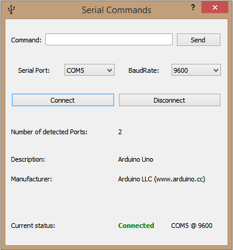

# Serial-Commands-QT
Basic application that connects and writes to serial ports.

Made as my first attempt at the QT framework, can be used to sent commands through serial to external devices like microcontrollers.

